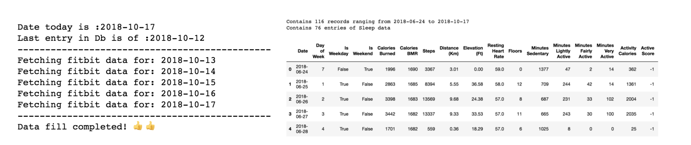
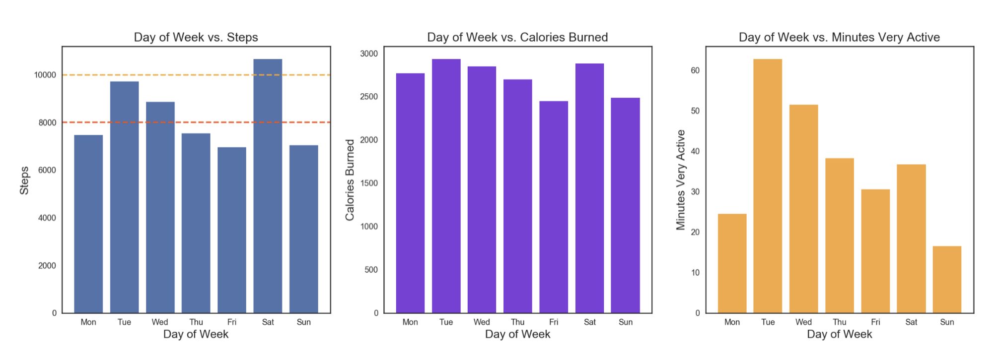
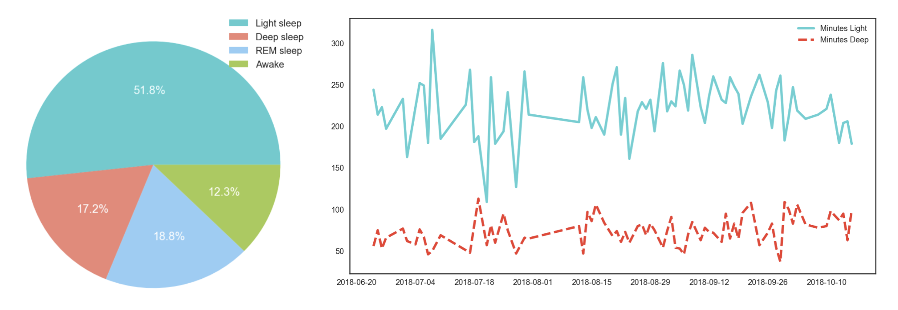

# Fitbit Analyzer
An experiment to extract meaningful insights from my fitbit data.

For a detailed summary, please read this [Medium Blogpost.](https://medium.freecodecamp.org/how-i-analyzed-the-data-from-my-fitbit-to-improve-my-overall-health-a2e36426d8f9)

This project consists of 2 parts.

 1. [A Fitbit data grabber](https://github.com/yashatgit/fitbit-analyzer/blob/master/Fitbit_Data_Collection.ipynb)
 2. [A Jupyter notebook to do the data analysis](https://github.com/yashatgit/fitbit-analyzer/blob/master/Fitbit_Data_Analysis.ipynb)

The Data grabber creates an excel based database and dumps the data from the fitbit servers using an oAuth layer.

This is a sample screenshot of a typical data grab session.

The Jupyter notebook serves a playground to apply data science on top of this database and extracts some interesting insights.

