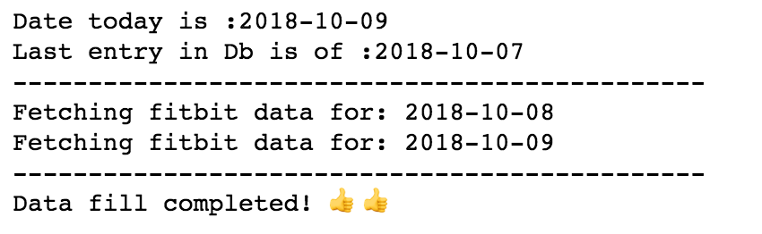

# Fitbit Analyzer
An experiment to extract meaningful insights from my fitbit data.

This project consists of 2 parts.

 1. A Fitbit data grabber
 2. A Jupyter notebook to do the data analysis

The Data grabber creates an excel based database and dumps the data from the fitbit servers using an oAuth layer.

This is a sample screenshot of a typical data grab session.

The Jupyter notebook serves a playground to apply data science on top of this database and extracts some interesting insights.
